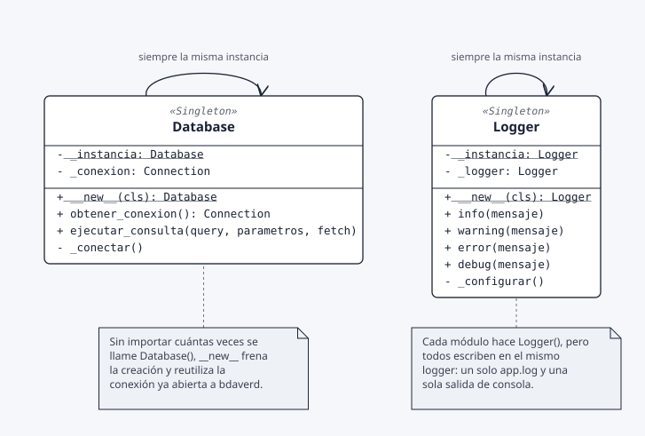
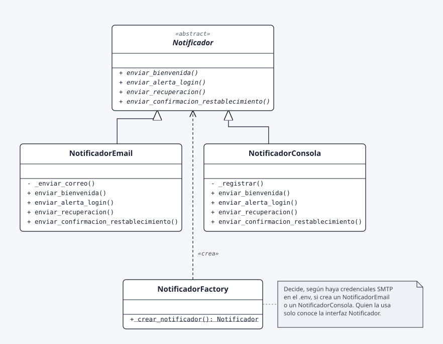
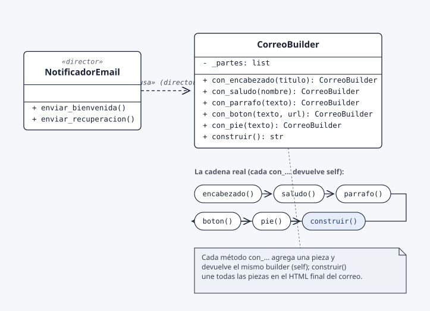

# Semana 5 — Diagramas UML de los patrones implementados

Esta carpeta documenta, con diagramas UML, los patrones de diseño que existen
**en el código real del proyecto** a la fecha de esta entrega: Singleton,
Factory Method y Builder. No incluye Prototype porque no está implementado
(ver nota al final).

## Cómo leer los diagramas

| Notación | Significado |
|---|---|
| Línea sólida + triángulo hueco | Herencia (`implementa`/`extiende`) |
| Línea punteada + flecha abierta | Dependencia (`usa` / `crea`) |
| Subrayado (`_instancia`) | Miembro de clase (estático) |
| Cursiva (`método()`) | Clase o método abstracto |
| Rectángulo con esquina doblada | Nota: explicación en palabras simples |

## Singleton — `config/database.py`, `utils/logger.py`

`Database` y `Logger` sobreescriben `__new__` para devolver siempre la misma
instancia: la conexión a `bdaverd` y los handlers de log se crean una sola
vez, sin importar cuántas veces se llame al constructor.

## Factory Method — `utils/notificador.py`

`NotificadorFactory.crear_notificador()` decide, según haya credenciales SMTP
configuradas en el `.env`, si devuelve un `NotificadorEmail` (correo real) o
un `NotificadorConsola` (log/consola). El controlador solo conoce la interfaz
`Notificador`.

## Builder — `utils/correo_builder.py`

`CorreoBuilder` arma el HTML de cada correo pieza por pieza (encabezado,
saludo, párrafos, botón, pie), encadenando llamadas que devuelven `self`,
hasta que `construir()` junta todo. `NotificadorEmail` actúa como director:
decide qué piezas pedir para cada tipo de correo.

## Resumen

| Patrón | Clase(s) | Archivo | Rol en el proyecto |
|---|---|---|---|
| Singleton | `Database` | `config/database.py` | Una sola conexión a `bdaverd` compartida por toda la app. |
| Singleton | `Logger` | `utils/logger.py` | Un solo logger con los mismos handlers hacia `app.log` y consola. |
| Factory Method | `NotificadorFactory` | `utils/notificador.py` | Elige entre correo real y consola sin acoplar el controlador a la clase concreta. |
| Builder | `CorreoBuilder` | `utils/correo_builder.py` | Arma el HTML de cada correo paso a paso en vez de un f-string gigante. |

## Nota sobre Prototype

Se revisó todo el repositorio (código y README) buscando `clone()`,
`copy.deepcopy` o una clase `Prototipo`/`Prototype`, y no existe ninguna
implementación de este patrón en el proyecto.
